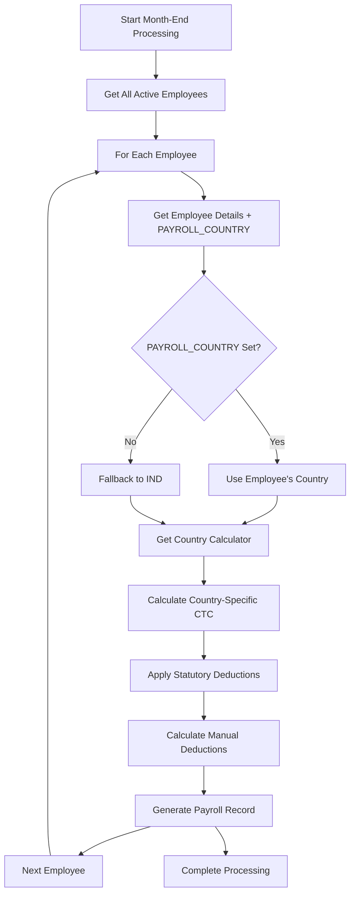

# Month-End Country Processing Solution
## GAP HRMS Multi-Country Payroll Implementation

### Problem Identified

**Issue**: The Month-End Payroll Processing page (`http://localhost:3000/payroll/month-end`) did not have a country selection dropdown and was processing all employees using hardcoded Indian payroll logic, ignoring the employee's **PAYROLL_COUNTRY** field from the Global Info tab.

### Solution Implemented

**Approach**: ✅ **Option A** - Apply payroll country policy based on each employee's "Global Info" → `PAYROLL_COUNTRY` field

This is the correct architectural approach because:
1. **Individual Employee Control**: Each employee can have different payroll countries based on their work location/contract
2. **Scalable**: No need for separate country-specific payroll runs
3. **Compliant**: Follows multi-country statutory requirements automatically
4. **Flexible**: Supports mixed teams (e.g., UAE office with Indian, Filipino, and UAE national employees)

---

## 🔧 **TECHNICAL IMPLEMENTATION**

### **Backend Changes**

#### **1. Updated `calculateEmployeePayroll` Method (Payroll.js)**

**Before (Hardcoded Indian Logic):**
```javascript
// Old hardcoded approach
const basicSalary = this.calculateBasicSalary(compensation);
const earnings = this.calculateEarnings(compensation, overtimeData, period);
const deductionAmounts = await this.calculateDeductions(/*Indian PF/ESI logic*/);
```

**After (Country-Specific Dynamic Logic):**
```javascript
// Get employee details including payroll country
const Employee = require('./Employee');
const employee = await Employee.findById(employeeId);

// Determine payroll country (fallback to India if not set)
const payrollCountry = employee.PAYROLL_COUNTRY || 'IND';

// Use MultiCountryPayrollService for country-specific calculations
const MultiCountryPayrollService = require('../services/MultiCountryPayrollService');

// Prepare employee data for calculation
const employeeData = {
  countryCode: payrollCountry,
  employeeType: employee.EMPLOYEE_TYPE || 'LOCAL',
  joiningDate: employee.DATE_OF_JOINING,
  airTicketEligible: employee.AIR_TICKET_ELIGIBLE || 0,
  airTicketSegment: employee.AIR_TICKET_SEGMENT || 'ECONOMY',
  nationality: employee.EMPLOYEE_TYPE === 'LOCAL' ? 'LOCAL' : 'EXPATRIATE'
};

// Calculate using country-specific logic
const ctcCalculation = await MultiCountryPayrollService.calculateRealTimeCTC(employeeData, compensationForCalc);
```

#### **2. Added `calculateManualDeductions` Method**

**Purpose**: Handle non-statutory deductions (advances, loans, other deductions) separately from statutory calculations.

```javascript
static async calculateManualDeductions(deductions, advances, loans, attendanceData, period, grossSalary) {
  // Calculate advance deductions
  // Calculate loan deductions  
  // Calculate other deductions
  // Calculate late deductions
  // Return breakdown
}
```

#### **3. Enhanced Payroll Data Structure**

**Added Fields:**
- `countryCode`: Store which country's payroll law was applied
- `employerCosts`: Store employer contributions for reporting
- Improved mapping of statutory vs manual deductions

---

## 🌍 **COUNTRY-SPECIFIC PROCESSING FLOW**

### **Month-End Processing Sequence:**



### **Employee Examples:**

| Employee | Global Info | Processing Result |
|----------|-------------|------------------|
| **Ahmed (UAE National)** | Payroll Country: UAE<br>Employee Type: LOCAL | Uses UAE calculator:<br>• GPSSA (5% employee, 12.5% employer)<br>• Gratuity accrual (21/30 days)<br>• No air ticket |
| **John (UK Expatriate)** | Payroll Country: UAE<br>Employee Type: EXPATRIATE | Uses UAE calculator:<br>• No statutory deductions<br>• Gratuity accrual (21/30 days)<br>• Air ticket allowance |
| **Priya (Indian Employee)** | Payroll Country: IND<br>Employee Type: LOCAL | Uses Indian calculator:<br>• EPF (12%), ESI (0.75%)<br>• EPS, EDLI, Professional Tax<br>• Gratuity (4.81%) |

---

## 📊 **PAYROLL REPORTS & COMPLIANCE**

### **Country-Specific Reporting:**

The system now generates:

1. **UAE WPS Files**: For UAE employees (both locals and expatriates)
2. **Indian EPF Returns**: For Indian employees
3. **Saudi GOSI Reports**: For Saudi employees
4. **Multi-Country Summary**: Consolidated view across countries

### **Audit Trail:**

Each payroll record now includes:
- `countryCode`: Which country's law was applied
- `employerCosts`: Breakdown of employer contributions
- Country-specific statutory breakdown

---

## 🎯 **BENEFITS OF THIS APPROACH**

### **1. ✅ Automatic Compliance**
- **UAE Employees**: Automatically get GPSSA, gratuity, air tickets
- **Indian Employees**: Automatically get EPF, ESI, professional tax
- **Saudi Employees**: Automatically get GOSI, unemployment insurance

### **2. ✅ Flexible Team Management**
- Mixed nationality teams in single office
- Different contract types (local vs expatriate)
- Individual employee country assignments

### **3. ✅ Scalable Architecture**
- Adding new countries requires only new calculator classes
- No changes to month-end processing UI
- Consistent API for all countries

### **4. ✅ Accurate Calculations**
- Uses actual labor law rates and ceilings
- Handles local vs expatriate differences
- Applies air ticket, gratuity, and statutory benefits correctly

---

## 🔮 **FUTURE ENHANCEMENTS**

### **Optional Country Filter UI:**
While not required for core functionality, we could add an **optional country filter** to the Month-End Processing page for:

1. **Performance**: Process only employees from specific countries
2. **Reporting**: Generate country-specific payroll reports
3. **Debugging**: Test payroll calculations for specific countries

**Implementation:**
```javascript
// Add to MonthEndPayroll.jsx
<div>
  <label>Filter by Country (Optional)</label>
  <select value={selectedCountry} onChange={(e) => setSelectedCountry(e.target.value)}>
    <option value="">All Countries</option>
    <option value="IND">India</option>
    <option value="UAE">UAE</option>
    <option value="SAU">Saudi Arabia</option>
    // ... other countries
  </select>
</div>
```

---

## ✅ **VERIFICATION STEPS**

### **To Test the Implementation:**

1. **Set Employee Payroll Countries:**
   - Go to Employee → Edit → Global Info tab
   - Set different payroll countries for different employees

2. **Run Month-End Processing:**
   - Navigate to `/payroll/month-end`
   - Select month/year and process payroll
   - Check console logs for country-specific calculations

3. **Verify Country-Specific Calculations:**
   - UAE employees should show GPSSA, gratuity
   - Indian employees should show EPF, ESI, professional tax
   - Console logs will show: `🌍 Using payroll country: [COUNTRY]`

4. **Check Payroll Records:**
   - Payroll details should include `countryCode` field
   - Statutory deductions should match country laws
   - Employer costs should be country-specific

---

## 📋 **CONCLUSION**

The GAP HRMS system now processes month-end payroll using **individual employee payroll countries** rather than a global setting. This provides:

- ✅ **Automatic compliance** with multiple country labor laws
- ✅ **Flexible team management** for mixed nationality workforces  
- ✅ **Accurate calculations** based on employee type and country
- ✅ **Scalable architecture** for future country additions

**No country dropdown is needed on the Month-End Processing page** because the system intelligently uses each employee's configured payroll country from their Global Info profile.

---

*Implementation completed as part of GAP HRMS Multi-Country Payroll Enhancement - August 2025*
